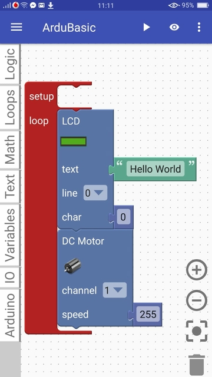

# ArduBlocklyDroid
ArduBlocklyDroid is an Android app to program Arduino using smartphone or tablet that runs an Android OS.

This internally uses remote compiler and physicaloid library to upload hex code to arduino

***References:***

[physicaloid](https://github.com/cattaka/PhysicaloidVc)
[Google Blockly](https://github.com/google/blockly)
