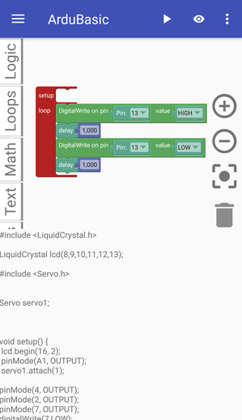
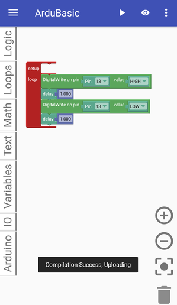
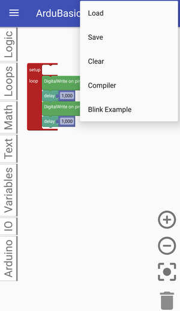
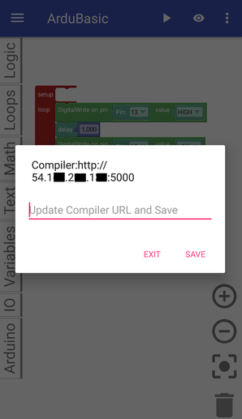
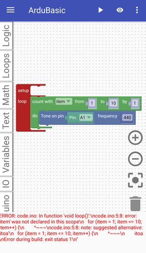
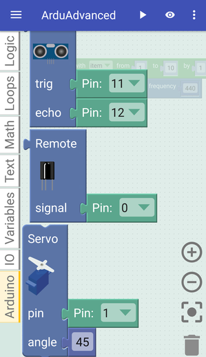

# ArduBlocklyDroid
ArduBlocklyDroid is an Android app to program Arduino using smartphone or tablet that runs an Android OS.

This internally uses remote compiler and physicaloid library to upload hex code to arduino

 
Block and code can be viewed parallel and uploads code to Arduino UNO after remote compilation of ino file generated.
 
Remote Compiler configuration and editable, host the compiler in cloud and change the url to make it work. Compiler setup link - https://github.com/suriyanath/avrcompile
 
Error handling on compile and runtime and lot of blocks to interface with sensors and motors directly

***References:***

[physicaloid](https://github.com/cattaka/PhysicaloidVc)
[Google Blockly](https://github.com/google/blockly)
